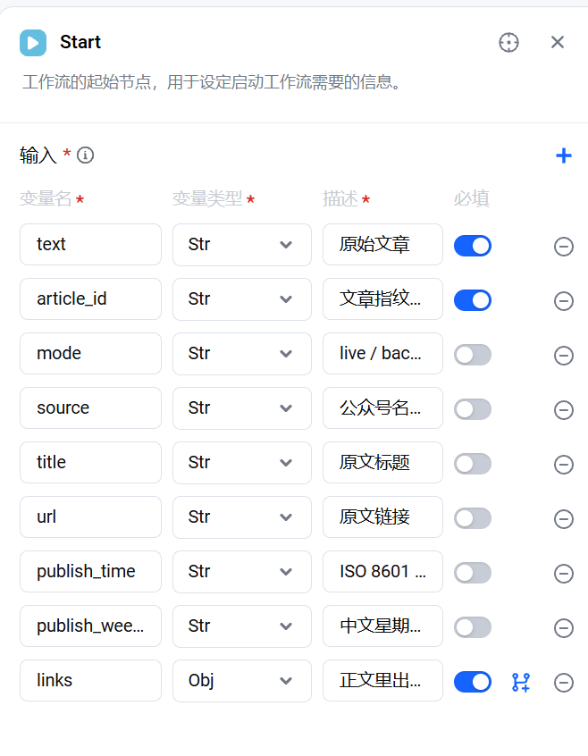

# 阶段 3 · GeniOS 工作流搭建说明（v1，以「打通链路」为目标）

> **给 [人]**：这份文档是逐节点的搭建手册。每个节点写清了「放什么、连什么、粘什么内容」。
> 全部可粘贴内容都在 `genios/` 目录里，本文只写「怎么装」。
>
> **本版目标**：**先打通整条链路**，所以刻意用**单大模型节点**同时做「判断 + 抽取」。
> 跑通之后，再按 PLAN §6 演进成「大模型1 分类 → 循环 → 大模型2 按类型抽取」的两段式。
>
> ⚠️ 界面描述来自实测与推断。**和你看到的不一样时以你看到的为准，截图给我。**

---

## 0. 前置

| 项 | 状态 |
| --- | --- |
| gateway 可被 GeniOS 访问 | ✅ S5 已验证 |
| GeniOS API 可被 gateway 调用 | ✅ Q1 已验证（`run_app_workflow`） |
| 大模型节点支持 JSON 输出 | ✅ Q2 已验证（节点有「输出格式」开关） |
| 代码节点 = Python 3.10，支持 json/re/datetime/zoneinfo | ✅ Q3 已验证 |
| 代码节点契约 | ✅ 必须定义 `def handler(inputs): ... return {...}` |

**gateway 地址**：GeniOS 的 HTTP 节点要打到的地址。当前测试期用的是临时隧道，
正式环境换成网关的真实地址。探针期 URL 见 `docs/findings.md` 的 S5 一节。

**共享密钥**：HTTP 节点要带的请求头 `X-Internal-Secret: <见 .env 的 INTERNAL_SHARED_SECRET>`。

---

## 1. 节点清单与连线

```
┌─────────┐
│  Start  │  接收 gateway 传来的文章
└────┬────┘
     ▼
┌─────────────────┐
│ 大模型节点       │  判断是不是机会 + 抽取字段，输出 JSON
│（输出格式=JSON） │  提示词见 genios/prompts/step1_extract.md
└────┬────────────┘
     ▼
┌─────────────────┐
│ 代码节点         │  解析 raw_output 字符串 + 三层校验
│                 │  代码见 genios/code_nodes/parse_and_validate.py
└────┬────────────┘
     │  输入要连两个上游：大模型节点 + Start（校验需要原文）
     ▼
┌─────────────────┐
│ 选择器（可选）   │  item_count == 0 → 走 End，不回写
└────┬────────────┘
     ▼
┌─────────────────┐
│ HTTP 请求节点    │  POST <gateway>/opportunities
│                 │  请求体 = 代码节点输出的 items[0]
└────┬────────────┘
     ▼
┌─────────┐
│   End   │
└─────────┘
```

---

## 2. 逐节点配置

### 2.1 Start 节点

**参数**：与 gateway 契约（PLAN §7.1）一致。gateway 发出的请求体是：

```json
{"InputData": "{\"article_id\":\"…\",\"mode\":\"live\",\"source\":\"…\",\"title\":\"…\",
               \"url\":\"…\",\"publish_time\":\"…\",\"publish_weekday\":\"…\",
               \"text\":\"…\",\"links\":[\"…\"]}",
 "UserID":"campus-gateway","NoDebug":true}
```

`InputData` 会解析成对象，**键名就是 Start 节点的参数名**。Start 支持自行添加参数
（变量名 / 变量类型 / 描述 / 是否必须），所以照下表建 **9 个参数**：


（上图是在 GeniOS 里实际配好的样子）

| 变量名 | 变量类型 | 必须 | 描述 |
| --- | --- | --- | --- |
| `article_id` | 字符串 | ✅ 是 | 文章指纹（sha256），回写时必须带回去 |
| `mode` | 字符串 | 否 | `live` / `backfill`；`backfill` 表示历史文章，不推送 |
| `source` | 字符串 | 否 | 公众号名，如「NKU计算机」 |
| `title` | 字符串 | 否 | 原文标题 |
| `url` | 字符串 | 否 | 原文链接 |
| `publish_time` | 字符串 | 否 | ISO 8601 带 +08:00，用于推算相对日期 |
| `publish_weekday` | 字符串 | 否 | 中文星期，如「星期三」，用于推算「本周五」 |
| `text` | 字符串 | ✅ 是 | 清洗后的正文 —— **抽取全靠它** |
| `links` | **数组**（元素为字符串） | 否 | 正文里出现的全部链接，供报名链接校验 |

> **只有 `article_id` 和 `text` 标「必须」**，其余留不必填 —— 万一某篇文章缺字段，
> 让它带着空值流下去、由校验层去发现，比工作流直接启动失败更好排查。

> `mode` 字段当前用不上（D8 决定稳态下不做 backfill 判定），但**先建着**，
> 将来补历史语料（阶段 5）会用到。

### 2.2 大模型节点

| 配置项 | 值 |
| --- | --- |
| 系统提示词 | `genios/prompts/step1_extract.md` 的「系统提示词」整段 |
| 用户提示词 | 同文件「用户提示词」整段，`{{ }}` 换成 Start 的实际变量 |
| 输出格式 | **JSON**（节点自带开关） |
| 温度 | 最低 / 0 |

⚠️ **本节点的输出信封是 `{"raw_output": "<字符串>"}` —— 里面的 JSON 是字符串不是对象。**
这是实测结论，也是为什么后面必须跟一个代码节点。

### 2.3 代码节点

| 配置项 | 值 |
| --- | --- |
| 代码 | `genios/code_nodes/parse_and_validate.py` 整份 |
| 输入 | **必须连两个上游**：大模型节点 + Start 节点 |

**为什么必须连 Start**：第三层「依据校验」要拿抽取出的原文片段去**原文里做子串匹配**，
没有原文就校验不了。代码里的 `_collect()` 会递归扫描输入结构，所以平铺还是嵌套都能找到。

**输出**（键名已对齐 gateway，HTTP 节点可原样转发）：

```json
{"ok": true, "is_opportunity": true, "article_id": "…",
 "items": [ {…一条机会记录…} ],
 "issues": ["…校验发现的问题…"],
 "item_count": 1}
```

### 2.4 选择器节点（可选但建议）

条件：`代码节点.item_count == 0` → 直接走 End（非机会文章，不回写）。
这样非机会文章不会在库里留下空记录。

### 2.5 HTTP 请求节点

```
方法：POST
URL：  <gateway 地址>/opportunities
Header：
  Content-Type: application/json
  X-Internal-Secret: <见 .env 的 INTERNAL_SHARED_SECRET>
Body： 代码节点输出的 items[0]
```

> ⚠️ **`X-Internal-Secret` 必须带**。gateway 的 `/opportunities` 是**要鉴权**的（402/401），
> 不带会直接被拒。这和探针期的 `/_debug/echo`（免鉴权）不同。

**响应**：

```json
{"ok": true, "created": true, "duplicate": false,
 "push_status": "未推送", "low_confidence": false, "status": "可参与", "…": "…"}
```

`duplicate=true` 表示这条机会之前已经入库（同一活动被两个号转发），**此时不要推送**（验收第 4、5 条）。

### 2.6 飞书推送（阶段 4，本版暂不做）

本版先只做到「回写 gateway」。卡片与推送见 `genios/feishu_cards/`，等 S4 验完版式再接。

---

## 3. 怎么测

1. **先单独测大模型节点**：用 `docs/genios_s2_experiments.md` 实验 A 的输入，确认输出是纯 JSON。
2. **再测代码节点**：直接拿上一步的输出喂进去，看 `issues` 是否为空。
3. **整体试运行**：用 `eval/samples/` 里的真实文章，或直接让真实的公众号文章走一遍完整链路。
4. **核对库里的结果**：`curl <gateway>/opportunities` 看记录是否正确。

> 本地已验证的样例（代码节点 → gateway 全通）见 `docs/findings.md`
> 「已用源码推导的载荷做实测」与阶段 3 相关条目。

---

## 4. 跑通之后的演进（别现在做）

按 PLAN §6 升级成两段式：

```
大模型1（轻量分类）→ 选择器 → 循环 items → 按 type 选抽取提示词 → 大模型2（按类型抽取）
                                    → 代码节点（校验）→ HTTP 回写 → 分级 → 飞书推送
```

好处：每种类型可以有专属的抽取提示词与字段，准确率更高。
**只有在单节点版跑通、链路验过之后**再动这一步。

---

## 5. 已知坑（都踩过了）

| 坑 | 说明 |
| --- | --- |
| 大模型输出是字符串 | 信封 `{"raw_output": "…"}`，必须解析 |
| 代码节点不能用 `return` | 必须是 `def handler(inputs): … return {…}` |
| 代码节点**不能有 `from __future__ import`** | codebox 会在我们的代码**前面插入约 15 行**，所以任何「必须在文件最开头」的语句都会报 `SyntaxError`。我们的代码实际从第 16 行开始。 |
| `InputData` 是字符串 | gateway 侧模板已处理；手工调试时注意 |
| 日期推算依赖发布时间 | 提示词必须真的带上 `publish_time` 与 `publish_weekday` |
| 飞连网关有限速 | 快速连续调用会被拒，测试时放慢 |
| HTTP 节点要带密钥 | `/opportunities` 要鉴权，不是免认证端点 |
